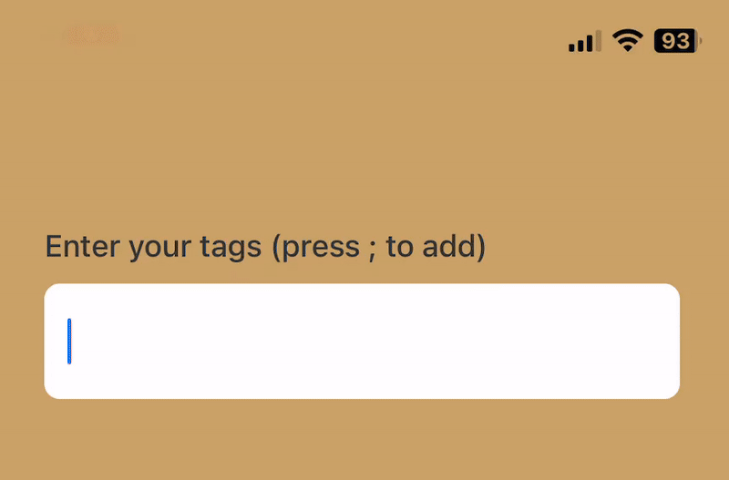

# react-native-input-tag

[](https://badge.fury.io/js/react-native-input-tag) [](https://www.npmjs.com/package/react-native-input-tag) [](https://github.com/julekgwa/react-native-input-tag) [](https://github.com/julekgwa/react-native-input-tag/blob/main/LICENSE) [](https://github.com/julekgwa/react-native-input-tag/issues) [](https://github.com/julekgwa/react-native-input-tag/network) [](https://www.typescriptlang.org/) [](https://reactnative.dev/) [](https://reactnative.dev/) [](https://bundlephobia.com/package/react-native-input-tag) [](https://snack.expo.dev/@lekgwaraj/react-native-input-tag) [](https://github.com/julekgwa/react-native-input-tag/graphs/commit-activity) [](https://github.com/julekgwa/react-native-input-tag/pulls)

Versatile and user-friendly component designed to simplify the process of entering and managing tags within a React Native application.

## Installation

```sh
bun add react-native-input-tag
```

## Demo

<p align="center">
  
</p>

> 📱 **Interactive Demo**: Check out the [example app](./example) to see all features in action!

### 🚀 Try it online

**[📱 Live Demo on Expo Snack](https://snack.expo.dev/@lekgwaraj/react-native-input-tag)**

Try the component directly in your browser or on your device with Expo Go!

## Table of Contents

- [react-native-input-tag](#react-native-input-tag)
  - [Installation](#installation)
  - [Demo](#demo)
    - [🚀 Try it online](#-try-it-online)
  - [Table of Contents](#table-of-contents)
  - [Quick Start](#quick-start)
  - [Features](#features)
    - [🎯 Core Features](#-core-features)
    - [🎨 Customization \& Styling](#-customization--styling)
    - [🚀 Developer Experience](#-developer-experience)
  - [Usage](#usage)
    - [Basic Usage](#basic-usage)
    - [Advanced Customization](#advanced-customization)
    - [Custom Suggestion Rendering](#custom-suggestion-rendering)
    - [Custom Tag Rendering](#custom-tag-rendering)
    - [Custom Delete Button](#custom-delete-button)
  - [API](#api)
    - [Props](#props)
      - [Core Props](#core-props)
      - [Styling Props](#styling-props)
      - [Autocomplete Customization Props](#autocomplete-customization-props)
      - [Element Props](#element-props)
    - [Methods](#methods)
  - [Contributing](#contributing)
    - [Development Setup](#development-setup)
    - [Code of Conduct](#code-of-conduct)
  - [Acknowledgments](#acknowledgments)
  - [License](#license)
  - [Stats](#stats)

## Quick Start

Get up and running in under 2 minutes:

```bash
# Install the package
bun add react-native-input-tag

# Import and use in your component
import { TagInput } from 'react-native-input-tag';
```

```tsx
const [tags, updateState] = useState({ tag: '', tagsArray: [] });

<TagInput
  tags={tags}
  updateState={updateState}
  suggestions={['React', 'TypeScript', 'Mobile']}
/>
```

**🎮 Want to try it first?** → **[Open Interactive Demo](https://snack.expo.dev/@lekgwaraj/react-native-input-tag)**

## Features

### 🎯 Core Features
- 📝 **Easy tag input and management** - Simple and intuitive API
- 🔍 **Fully customizable autocomplete** - Advanced filtering with highlighting
- 🎨 **Complete custom rendering** - Support for suggestions, tags, and delete buttons
- ⌨️ **Customizable key separators** - Space, comma, semicolon, or any character
- ♿ **Full accessibility support** - Screen reader friendly with proper ARIA labels

### 🎨 Customization & Styling
- 🎯 **Extensive styling options** - Style every component independently
- 💡 **Text highlighting** - Highlight matched text in suggestions
- 📊 **Configurable suggestion limits** - Control autocomplete behavior
- 🔤 **Case-sensitive/insensitive** - Flexible filtering options

### 🚀 Developer Experience
- 📱 **Cross-platform** - Works on iOS, Android, and Web
- 🚀 **Complete TypeScript support** - Full type safety and IntelliSense
- 📖 **Comprehensive documentation** - Detailed examples and API reference
- 🧪 **Well tested** - Extensive test coverage for reliability


## Usage

### Basic Usage

```tsx
import React, { useState } from 'react';
import { View } from 'react-native';
import { TagInput, type ITags } from 'react-native-input-tag';

export default function App() {
  const [tags, updateState] = useState<ITags>({ tag: '', tagsArray: [] });

  return (
    <View style={{ flex: 1, padding: 20 }}>
      <TagInput
        label="Enter Tags"
        tags={tags}
        updateState={updateState}
        keysForTag=";" // Use semicolon to separate tags
        suggestions={['React', 'Native', 'JavaScript', 'TypeScript']}
        inputStyle={{ backgroundColor: '#f0f0f0', borderRadius: 8 }}
        tagStyle={{ backgroundColor: '#007bff', borderRadius: 12 }}
        tagTextStyle={{ color: 'white' }}
      />
    </View>
  );
}
```

### Advanced Customization

```tsx
import React, { useState } from 'react';
import { View, StyleSheet } from 'react-native';
import { TagInput, type ITags } from 'react-native-input-tag';

export default function AdvancedExample() {
  const [tags, updateState] = useState<ITags>({ tag: '', tagsArray: [] });

  return (
    <View style={styles.container}>
      <TagInput
        label="Skills & Technologies"
        tags={tags}
        updateState={updateState}
        keysForTag=","
        suggestions={[
          'React Native', 'JavaScript', 'TypeScript', 'Node.js',
          'MongoDB', 'PostgreSQL', 'GraphQL', 'REST API',
          'iOS', 'Android', 'React', 'Vue.js'
        ]}
        // Autocomplete customization
        maxSuggestions={4}
        highlightMatchedText={true}
        caseSensitive={false}
        showAutocompleteBorder={true}
        // Styling
        containerStyle={styles.tagInputContainer}
        inputStyle={styles.input}
        labelStyle={styles.label}
        tagStyle={styles.tag}
        tagTextStyle={styles.tagText}
        autocompleteContainerStyle={styles.autocompleteContainer}
        autocompleteSuggestionItemStyle={styles.suggestionItem}
        autocompleteSuggestionTextStyle={styles.suggestionText}
      />
    </View>
  );
}

const styles = StyleSheet.create({
  container: {
    flex: 1,
    padding: 20,
    backgroundColor: '#f5f5f5',
  },
  tagInputContainer: {
    backgroundColor: 'white',
    borderRadius: 12,
    padding: 16,
    shadowColor: '#000',
    shadowOffset: { width: 0, height: 2 },
    shadowOpacity: 0.1,
    shadowRadius: 4,
    elevation: 3,
  },
  input: {
    borderWidth: 1,
    borderColor: '#e0e0e0',
    borderRadius: 8,
    paddingHorizontal: 12,
    paddingVertical: 10,
    fontSize: 16,
  },
  label: {
    fontSize: 16,
    fontWeight: '600',
    color: '#333',
    marginBottom: 8,
  },
  tag: {
    backgroundColor: '#4CAF50',
    borderRadius: 20,
    paddingHorizontal: 12,
    paddingVertical: 6,
  },
  tagText: {
    color: 'white',
    fontSize: 14,
    fontWeight: '500',
  },
  autocompleteContainer: {
    backgroundColor: 'white',
    borderRadius: 8,
    shadowColor: '#000',
    shadowOffset: { width: 0, height: 4 },
    shadowOpacity: 0.15,
    shadowRadius: 8,
    elevation: 8,
    maxHeight: 200,
  },
  suggestionItem: {
    paddingVertical: 12,
    paddingHorizontal: 16,
    backgroundColor: '#fafafa',
  },
  suggestionText: {
    fontSize: 15,
    color: '#333',
  },
});
```

### Custom Suggestion Rendering

For maximum flexibility, you can provide a custom render function for suggestion items. The `renderSuggestion` function receives the `onPress` callback, giving you complete control over how and when the suggestion is selected:

```tsx
import React, { useState } from 'react';
import { View, Text, StyleSheet, TouchableOpacity } from 'react-native';
import { TagInput, type ITags } from 'react-native-input-tag';

export default function CustomRenderExample() {
  const [tags, updateState] = useState<ITags>({ tag: '', tagsArray: [] });

  const renderCustomSuggestion = (
    suggestion: string,
    index: number,
    isHighlighted: boolean,
    onPress: () => void
  ) => {
    return (
      <TouchableOpacity
        style={[
          styles.customSuggestion,
          isHighlighted && styles.highlighted,
        ]}
        onPress={onPress}
        accessibilityRole="button"
        accessibilityLabel={`Select suggestion: ${suggestion}`}
      >
        <Text style={styles.emoji}>🏷️</Text>
        <Text style={styles.suggestionText}>{suggestion}</Text>
        <Text style={styles.badge}>#{index + 1}</Text>
      </TouchableOpacity>
    );
  };

  return (
    <TagInput
      tags={tags}
      updateState={updateState}
      suggestions={['React', 'JavaScript', 'TypeScript']}
      renderSuggestion={renderCustomSuggestion}
      autocompleteContainerStyle={styles.container}
    />
  );
}

const styles = StyleSheet.create({
  container: {
    backgroundColor: 'white',
    borderRadius: 8,
    elevation: 4,
  },
  customSuggestion: {
    flexDirection: 'row',
    alignItems: 'center',
    padding: 12,
    borderBottomWidth: 1,
    borderBottomColor: '#f0f0f0',
  },
  highlighted: {
    backgroundColor: '#e3f2fd',
  },
  emoji: {
    fontSize: 16,
    marginRight: 8,
  },
  suggestionText: {
    flex: 1,
    fontSize: 15,
    fontWeight: '500',
  },
  badge: {
    backgroundColor: '#007bff',
    color: 'white',
    fontSize: 10,
    paddingHorizontal: 6,
    paddingVertical: 2,
    borderRadius: 10,
    fontWeight: 'bold',
  },
});
```

**Key Benefits:**
- ✅ **Complete control**: Render any React component structure
- ✅ **Avoid nested touchables**: You handle the touch events directly
- ✅ **Custom interactions**: Add buttons, swipe actions, or complex gestures
- ✅ **Type safety**: Full TypeScript support with proper parameter types
- ✅ **Accessibility**: Add custom accessibility props as needed

### Custom Tag Rendering

You can also customize how individual tags are rendered using the `renderTag` prop:

```tsx
import React, { useState } from 'react';
import { View, Text, StyleSheet, TouchableOpacity } from 'react-native';
import { TagInput, type ITags } from 'react-native-input-tag';

export default function CustomTagExample() {
  const [tags, updateState] = useState<ITags>({
    tag: '',
    tagsArray: ['Design', 'Development']
  });

  const renderCustomTag = (
    tag: string,
    index: number,
    onDelete: () => void
  ) => (
    <View style={styles.customTag}>
      <Text style={styles.tagEmoji}>✨</Text>
      <Text style={styles.tagText}>{tag}</Text>
      <TouchableOpacity
        style={styles.deleteButton}
        onPress={onDelete}
        accessibilityRole="button"
        accessibilityLabel={`Delete tag: ${tag}`}
      >
        <Text style={styles.deleteText}>×</Text>
      </TouchableOpacity>
    </View>
  );

  return (
    <TagInput
      tags={tags}
      updateState={updateState}
      renderTag={renderCustomTag}
    />
  );
}

const styles = StyleSheet.create({
  customTag: {
    flexDirection: 'row',
    alignItems: 'center',
    backgroundColor: '#ff6b6b',
    borderRadius: 20,
    paddingVertical: 8,
    paddingHorizontal: 12,
    margin: 4,
    shadowColor: '#000',
    shadowOffset: { width: 0, height: 2 },
    shadowOpacity: 0.1,
    shadowRadius: 3,
    elevation: 3,
  },
  tagEmoji: {
    fontSize: 14,
    marginRight: 6,
  },
  tagText: {
    color: '#ffffff',
    fontSize: 14,
    fontWeight: '600',
    marginRight: 8,
  },
  deleteButton: {
    backgroundColor: 'rgba(255, 255, 255, 0.3)',
    borderRadius: 10,
    width: 20,
    height: 20,
    justifyContent: 'center',
    alignItems: 'center',
  },
  deleteText: {
    color: '#ffffff',
    fontSize: 16,
    fontWeight: 'bold',
  },
});
```

**Custom Tag Benefits:**
- 🎨 **Unique styling**: Create tags that match your app's design
- 🔧 **Custom actions**: Add multiple buttons or gestures to each tag
- 📊 **Dynamic content**: Show additional information like counts or status
- ♿ **Enhanced accessibility**: Custom accessibility labels and roles

### Custom Delete Button

For even more granular control, you can customize just the delete button while keeping the default tag styling:

```tsx
import React, { useState } from 'react';
import { TouchableOpacity, Text, StyleSheet } from 'react-native';
import { TagInput, type ITags } from 'react-native-input-tag';

export default function CustomDeleteExample() {
  const [tags, updateState] = useState<ITags>({
    tag: '',
    tagsArray: ['Design', 'Development']
  });

  const renderCustomDeleteButton = (
    onDelete: () => void,
    tag: string,
    index: number
  ) => (
    <TouchableOpacity
      style={styles.deleteBtn}
      onPress={onDelete}
      accessibilityRole="button"
      accessibilityLabel={`Remove tag: ${tag}`}
    >
      <Text style={styles.deleteIcon}>🗑️</Text>
    </TouchableOpacity>
  );

  return (
    <TagInput
      tags={tags}
      updateState={updateState}
      renderDeleteButton={renderCustomDeleteButton}
      tagStyle={styles.tag}
    />
  );
}

const styles = StyleSheet.create({
  tag: {
    backgroundColor: '#e9ecef',
    borderRadius: 8,
    paddingVertical: 4,
    paddingHorizontal: 8,
  },
  deleteBtn: {
    backgroundColor: '#dc3545',
    borderRadius: 10,
    width: 20,
    height: 20,
    justifyContent: 'center',
    alignItems: 'center',
    marginLeft: 6,
  },
  deleteIcon: {
    fontSize: 10,
  },
});
```

**Custom Delete Button Benefits:**
- 🎯 **Targeted customization**: Change only the delete button, keep tag styling
- 🔄 **Easy integration**: Works with existing tag styles
- 📱 **Consistent UX**: Maintain app-wide delete button patterns
- ⚡ **Performance**: Lighter than full custom tag rendering

## API

### Props

#### Core Props

| Prop | Type | Default | Description |
|------|------|---------|-------------|
| `tags` | `ITags` | required | Current tags state object |
| `updateState` | `(tags: ITags) => void` | required | Function to update tags state |
| `label` | `string` | optional | Label text displayed above input |
| `keysForTag` | `string` | `' '` | Character(s) used to separate tags |
| `suggestions` | `string[]` | optional | Array of suggestion strings for autocomplete |
| `disabled` | `boolean` | `false` | Whether the input is disabled |

#### Styling Props

| Prop | Type | Description |
|------|------|-------------|
| `containerStyle` | `StyleProp<ViewStyle>` | Style for the main container |
| `inputContainerStyle` | `StyleProp<ViewStyle>` | Style for the input container |
| `inputStyle` | `StyleProp<TextStyle>` | Style for the text input |
| `labelStyle` | `StyleProp<TextStyle>` | Style for the label text |
| `tagStyle` | `StyleProp<ViewStyle>` | Style for individual tag containers |
| `tagTextStyle` | `StyleProp<TextStyle>` | Style for tag text |
| `tagsViewStyle` | `StyleProp<ViewStyle>` | Style for the tags container |
| `deleteIconStyles` | `StyleProp<ImageStyle>` | Style for delete icons |

#### Autocomplete Customization Props

| Prop | Type | Default | Description |
|------|------|---------|-------------|
| `maxSuggestions` | `number` | `5` | Maximum number of suggestions to show |
| `caseSensitive` | `boolean` | `false` | Whether suggestion filtering is case sensitive |
| `highlightMatchedText` | `boolean` | `false` | Whether to highlight matched text in suggestions |
| `showAutocompleteBorder` | `boolean` | `true` | Whether to show borders between suggestions |
| `autocompleteContainerStyle` | `StyleProp<ViewStyle>` | Style for autocomplete dropdown container |
| `autocompleteSuggestionItemStyle` | `StyleProp<ViewStyle>` | Style for individual suggestion items |
| `autocompleteSuggestionTextStyle` | `StyleProp<TextStyle>` | Style for suggestion text |
| `renderSuggestion` | `(suggestion: string, index: number, isHighlighted: boolean, onPress: () => void) => ReactNode` | Custom render function for suggestion items |
| `renderTag` | `(tag: string, index: number, onDelete: () => void) => ReactNode` | Custom render function for tag items |
| `renderDeleteButton` | `(onDelete: () => void, tag: string, index: number) => ReactNode` | Custom render function for delete button only |

#### Element Props

| Prop | Type | Description |
|------|------|-------------|
| `leftElement` | `React.ReactElement` | Custom element to show on the left side |
| `rightElement` | `React.ReactElement` | Custom element to show on the right side |
| `customElement` | `React.ReactElement` | Custom element to show below input |
| `leftElementContainerStyle` | `StyleProp<ViewStyle>` | Style for left element container |
| `rightElementContainerStyle` | `StyleProp<ViewStyle>` | Style for right element container |

### Methods

The TagInput component provides several methods that can be accessed via ref:

- `focus()` - Focus the input
- `blur()` - Blur the input
- `clear()` - Clear the input text
- `isFocused()` - Check if input is focused
- `setNativeProps(props)` - Set native props on input

## Contributing

We welcome contributions! Please see our [Contributing Guide](CONTRIBUTING.md) for details.

### Development Setup

```bash
# Clone the repository
git clone https://github.com/julekgwa/react-native-input-tag.git
cd react-native-input-tag

# Install dependencies
yarn install

# Run the example app
yarn example ios
# or
yarn example android

# Run tests
yarn test

# Run linting
yarn lint

# Build the package
yarn prepare
```

### Code of Conduct

This project adheres to the [Code of Conduct](CODE_OF_CONDUCT.md). By participating, you are expected to uphold this code.

## Acknowledgments

This project was inspired by [react-native-input-tag](https://github.com/jimmybengtsson/react-native-input-tag) by Jimmy Bengtsson. We've built upon the foundational concept to create a more feature-rich and customizable tag input solution.

## License

MIT © [Junius Lekgwara](https://github.com/julekgwa)

## Stats


---
<p align="center">
  <sub>Built with <a href="https://github.com/callstack/react-native-builder-bob">create-react-native-library</a></sub>
</p>
